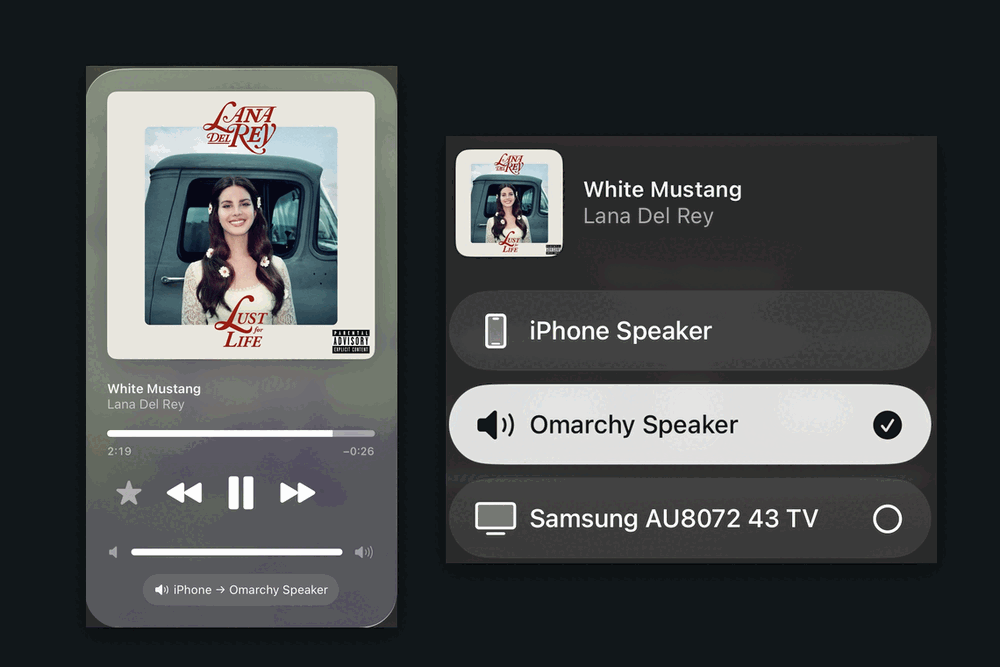

# OmairPlay


Turns your Omarchy machine into an AirPlay speaker with your iPhone as the remote.

Control your music, podcasts, audiobooks, etc. from your phone? No bloated desktop apps needed. Skip the buggy
Linux clients: tap your machine from the iOS AirPlay list, and the audio
comes out of your speakers, headphones, whatever audio source you want.

This plugin is a graphical interface with convenience features added to the tool
`shairport-sync`. OmairPlay installs what's needed, securely configures and maintains AirPlay on your local network, puts the controls
in your bar, and shows what's playing — all using your current Omarchy theme,
of course!

## Requirements

| | |
|---|---|
| Omarchy | 4.0.3 or newer (plugin API) |
| Audio | PipeWire with `pipewire-pulse` (the Omarchy default) |
| Discovery | `avahi-daemon` running (the Omarchy default) |
| Packages | `shairport-sync` and `nqptp` — **setup installs these** |
| Firewall | `ufw`, if enabled — **setup adds the rules** |

## Install

```bash
omarchy plugin add https://github.com/dmatthan/omairplay --enable
```

Then click the new bar icon and choose **Run setup**.

## Setup, and what it needs root for

Setup opens a terminal so you can read every command before approving the
password prompt. It:

1. Takes a system snapshot (`omarchy snapshot create`), if snapper is configured.
2. Installs `shairport-sync` and `nqptp`.
3. Enables `nqptp` as a **system** service — it needs privileged ports 319 and
   320 for AirPlay 2 clock sync.
4. Adds `ufw` rules **limited to private networks**, never to Anywhere. Each one
   is tagged `omairplay`, so you can always see what added it:

   ```bash
   sudo ufw status | grep omairplay
   ```
5. Writes the receiver's config and a user service under `$HOME`.

**The plugin itself never needs root while running.** Only setup, Repair and
removal do, and each runs visibly in a terminal.

The receiver runs as a user service, `omarchy-airplay.service`. A machine gets
one AirPlay 2 receiver, so if the packaged `shairport-sync` units are enabled,
setup tells you which one to disable and how.

## Using it

Pick your machine from the AirPlay list on your phone, and play:



The bar icon shows the receiver's state:

| Icon | Meaning |
|---|---|
| Speaker, dimmed | Off, or not set up |
| Speaker | Ready, waiting for a device |
| Cast | Playing |
| Speaker, alert colour | Needs repair — press Repair in the popup |

- **Click** — open the popup
- **Right-click** — turn the receiver on or off without opening anything
- In the popup: `j`/`k` or arrows to move, `Enter` to activate, `Esc` to close

The popup shows what's playing — title, artist, album, cover art, the sending
device's volume, and a level meter driven by the receiver's real output. When
the track changes, a notification appears with the cover art.

It takes its colours and font from whichever Omarchy theme you're using:


Control playback from your phone — it stays the player throughout.

## Settings

In the popup: **speaker name**, **start at login**, and **Repair**.

Renaming restarts the receiver, which interrupts playback, so it asks first.
Repair does too.

The rest are available via the bar config:

```bash
omarchy bar set io.github.dmatthan.omairplay trackNotifications false
omarchy bar set io.github.dmatthan.omairplay showArtwork false
omarchy bar set io.github.dmatthan.omairplay refreshIntervalSec 5
omarchy bar move io.github.dmatthan.omairplay --section right
```

## If the speaker appears but won't play

Open the popup. OmairPlay reads the live `ufw` rules and the receiver's own
health, and says so when something is wrong — missing rules, a new IPv6 prefix,
`nqptp` not running, or a track that is showing while no audio is arriving.

**Repair** fixes all of them. It reverts the receiver's setup and redoes it for
the addresses your machine has now, in one terminal, so it prompts once for your
password. It briefly stops the receiver, so it interrupts playback, and it puts
the receiver back the way it was — on, off, and whether it starts at login.

A receiver that is up but has stopped responding is restarted on its own, up to
twice in a quarter of an hour, before it asks you to press Repair.

The old workaround, **Uninstall** followed by setting it up again, still
works, but Repair is what it was doing, minus the guessing.

## Uninstalling it

Two steps, in this order.

1. **Uninstall** in the popup. Stops the receiver, disables it at login,
   deletes its config and cover art, removes the firewall rules it added, and
   turns `nqptp` back off if setup was what enabled it.
2. Remove the plugin:

   ```bash
   omarchy plugin remove io.github.dmatthan.omairplay
   ```

If you remove the plugin first, the uninstaller still works from its own copy:

```bash
~/.local/state/io.github.dmatthan.omairplay/airplay-remove --system
```

The `shairport-sync` and `nqptp` packages stay installed.

## What it puts on your system

| Path | What it is |
|---|---|
| `~/.config/shairport-sync/shairport-sync.conf` | the receiver's config, from your settings |
| `~/.config/systemd/user/omarchy-airplay.service` | the service that runs the receiver |
| `~/.cache/shairport-sync/` | cover art |
| `~/.local/state/io.github.dmatthan.omairplay/` | the uninstaller and the helpers the service needs |
| `ufw` rules | each tagged `omairplay`, private ranges only — the count depends on which ranges your machine is on |
| `nqptp.service` | enabled, for AirPlay 2 clock sync |
| `shairport-sync`, `nqptp` | packages, from Arch `extra` |

Only the last three touch anything outside `$HOME`. No autostart entries, no
`PATH` changes, no shell-profile edits, no scheduled jobs. Removal reverses all
of it.

## Notes on safety

Omarchy plugins run unsandboxed, with your user's permissions — this one
included. What that means here:

- Root is used only by setup, Repair and removal, each run visibly in a terminal
  so you can read every command before approving it.
- Firewall rules are limited to private address ranges, never to Anywhere, and
  `ufw` is never disabled or reset. Every rule is tagged `omairplay`, and
  removal finds them by that tag.
- Your local network is the trust boundary: a device has to be on it to reach
  the receiver.
- Commands are called by full path, in an environment the scripts build
  themselves, so nothing inherited from your session changes what runs.

## Licence

MIT — see [LICENSE](LICENSE).
