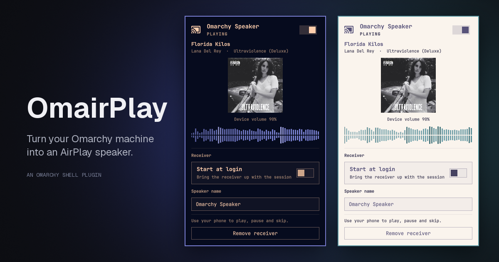

# OmairPlay



Turn your Omarchy machine into an AirPlay speaker.

Use your iPhone as a music remote for your Omarchy machine. Pick it from the
AirPlay list, and audio plays through your desktop.

`shairport-sync` can already do this from a terminal. OmairPlay exists because
the parts around it are the fiddly bit: it installs what's needed, opens only
the firewall ports AirPlay actually uses and only to your local network, puts
the receiver's state in your bar, and shows what's playing — using your current
Omarchy theme.

## Requirements

| | |
|---|---|
| Omarchy | 4.0.3 or newer (plugin API) |
| Audio | PipeWire with `pipewire-pulse` (the Omarchy default) |
| Discovery | `avahi-daemon` running (the Omarchy default) |
| Packages | `shairport-sync` and `nqptp` — **setup installs these** |
| Firewall | `ufw`, if enabled — **setup adds the rules** |

## Install

```bash
omarchy plugin add https://github.com/dmatthan/omairplay --enable
```

Then click the new bar icon and choose **Run setup**.

## Setup, and what it needs root for

Setup opens a terminal so you can read every command before approving the
password prompt. It:

1. Takes a system snapshot (`omarchy snapshot create`), if snapper is configured.
2. Installs `shairport-sync` and `nqptp`.
3. Enables `nqptp` as a **system** service — it needs privileged ports 319 and
   320 for AirPlay 2 clock sync.
4. Adds `ufw` rules **scoped to your local subnet**, never to Anywhere. Every
   rule is logged with the command that removes it.
5. Writes the receiver's config and a user service under `$HOME`.

**The plugin itself never needs root while running.** Only setup and removal do,
and both run visibly in a terminal.

The receiver runs as a **user** service, `omarchy-airplay.service`. The
`shairport-sync` packages ship their own system and user units; leave both
disabled — a machine has only one AirPlay 2 slot, and two receivers fight over
port 7000. OmairPlay refuses to set up while either is active, and tells you
how to disable it.

## Using it

The bar icon shows the receiver's state:

| Icon | Meaning |
|---|---|
| Speaker, dimmed | Off, or not set up |
| Speaker | Ready, waiting for a device |
| Cast | Playing |

- **Click** — open the popup
- **Right-click** — turn the receiver on or off without opening anything
- In the popup: `j`/`k` or arrows to move, `Enter` to activate, `Esc` to close

The popup shows what's playing — title, artist, album, cover art and the
sending device's volume.

## Playback control

There isn't any, deliberately. An AirPlay 2 receiver cannot pause or skip the
device sending to it — the protocol has no path for it, so `shairport-sync`
reports the controls as available while doing nothing. Rather than draw buttons
that silently fail, OmairPlay shows the track and says to use your phone.

Lossless audio and working transport controls both require a classic AirPlay 1
build, which is a different thing to install. Not supported here yet.

## Settings

In the popup: **speaker name** and **start at login**.

Renaming restarts the receiver, which interrupts playback, so it asks first.

Two more settings are available via the bar config:

```bash
omarchy bar set io.github.dmatthan.omairplay refreshIntervalSec 5
omarchy bar set io.github.dmatthan.omairplay showArtwork false
omarchy bar move io.github.dmatthan.omairplay --section right
```

## If your phone sees the speaker but won't connect

That's almost always the firewall: mDNS discovery passes through `ufw` while the
connection itself is blocked. OmairPlay checks the live `ufw` rules and will say
so in the popup, with a button to re-run setup.

It can also happen after your router hands out a new IPv6 prefix, which leaves
the old rule matching nothing. Same fix: re-run setup, which re-derives your
current addresses.

## Removing it

**Remove receiver** in the popup stops the receiver, disables it at login,
deletes its config and cover-art cache, and removes the firewall rules it added.
The `shairport-sync` and `nqptp` packages are left installed.

To remove the plugin as well:

```bash
omarchy plugin remove io.github.dmatthan.omairplay
```

## Notes on safety

Omarchy plugins run unsandboxed inside the shell process, with your user's
permissions — this one included. What that means here:

- Root is used only by `bin/airplay-setup` and `bin/airplay-remove`, both run
  visibly in a terminal. Neither is invoked with `pkexec`: the plugin folder is
  user-writable, so running a script from it as root would be a way to escalate.
- Firewall rules are always scoped to the local subnet, derived at runtime from
  the routing table. Nothing is opened to Anywhere, and `ufw` is never disabled
  or reset.
- Removal validates each recorded rule against the exact shape setup writes,
  and rebuilds the command from the matched fields rather than executing a line
  from a file.
- Firewall *state* is read from `/etc/ufw/user.rules`, which is world-readable.
  No privilege is needed or requested to check it.
- Nothing is written outside `$HOME`, apart from the packages and the `nqptp`
  system service enabled during setup.

## Licence

MIT — see [LICENSE](LICENSE).
